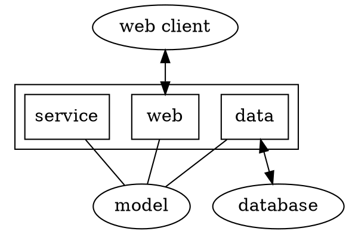

# OReilly FastAPI Modern Python Web Deployment Digests
# Chapter 1 - The Modern Web
API - connect things Vs. Content - HTML, images, js and etc.
In the modern web, API design is as important as the design of web site themselves.
API is a contract.

## Kinds of API
Each API defines some:
* Protocol: Control structure
* Format: Content structure

RESTful
- Uses HTTP and client-server
- Stateless: Each connection is independent
- Cacheable
- Resource-based

*resource*
*endpoint* - *route*
*verb*
- POST: Create(write)
- PUT: Modify completely(replace)
- PATCH: MOdify partially(update)
- GET: get(read, retrieve)
- DELETE: delete

*request*
- Headers
- URL string
- Query parameters
- Body values

*response*
- *status code*
	- 100s: Info, keep going
	- 200s: Success
	- 300s: Redirection
	- 400s: Client error
	- 500s: Server error
- Various headers
- Body: empty, single or chunked

418: I'm a teapot

## JSON and API Data Formats

## JSON:API
Tighten specs of combination of RESTful design and JSON data formats.

## GraphQL
For more flexible service queries.

## Concurrency
Avoid busy waiting
Asynchronous - `async` and `await`

## Layers
- Web
- Service
- Data
- Model

The layers talk to one another via APIs.
The Model isn't an actual layer, but a source of data definitions shared by the layers. Pydantic

Each layer can be:
- Written by specialists
- Tested in isolation
- Replaced or supplemented
Follow one rule: Don't cross the streams, don't let web details leak out of the Web layer, or database details out of the Data layer.



Client <-> Web: RESTful HTTP with JSON
Web <-> Service: Models
Service <-> Data: Models
Data <-> Databases and services: Specific APIs

- Sparate domain-specific details
- Define standard APIs between the layers
- Don't cheat, don't leak

## Data
SQL, NoSQL or NewSQL databases
ML or ETL

# Chapter 2 - Modern Python
## Virtual Environments
### Poetry
Combination of pip and venv.
`pip install poetry`

`poetry install`

`pyproject.toml`

## Source formatting
`pip install black`

## Testing
`pip install pytest`

## CI tools

## Web Tools

## Type Hints

# Chapter 3 - FastAPI Tour
## What Is FastAPI
Like any web framework, FastAPI helps you to build web applications. Every framework is designed to make some operations easier — by features, omissions, and defaults.

Some advantages claimed by the web site include:
- _Performance_: As fast as Node and Golang in some cases, unusual for Python frameworks.
- _Faster development_: No sharp edges or oddities.
- _Better code quality_: Type hinting and models help reduce bugs.
- _Autogenerated documentation and test pages_: Much easier than hand editing OpenAPI descriptions

FastAPI uses:
- Python type hints
- Starlette for the web machinery, including async support
- Pydantic for data definitions and validation
- Special integration to leverage and extend the others
Together, it’s a pleasing development environment for web applications, especially RESTful web services.

## A FastAPI Applications
### Basic Python packages:
- FastAPI
- Uvicorn
- Httpie
- Requests
- Httpx
```Text
# requirements.txt
fastapi
uvicorn
httpie
requests
httpx
```
### A very basic FastAPI app
```Python
from fastapi import FastAPI

app = FastAPI()

@app.get("/hi")
def greet():
    return "Hello? World?"
```

## HTTP Requests
```Text
GET /hi HTTP/1.1
Accept: /
Accept-Encoding: gzip, deflate
Connection: keep-alive
Host: localhost:8000
User-Agent: HTTPie/3.2.1
```

It contains:
- The verb (GET) and path (/hi).
- Any query parameters (stuff after any ?; in this case, none).
- Other HTTP headers.
- No request body content.

FastAPI unsquirrels these into handy definitions:
- Header: The HTTP headers
- Path: The URL
- Query: The query parameters (after the ? at the end of the URL)
- Body: The HTTP body
### Adding parameter

#### URL Path
```Python
from fastapi import FastAPI

app = FastAPI()

@app.get("/hi/{who}")
def greet(who):
    return f"Hello? {who}?"
```
`$ http localhost:8000/hi/Mom`

#### Query Parameters
```Python
from fastapi import FastAPI

app = FastAPI()

@app.get("/hi")
def greet(who):
    return f"Hello? {who}?"
```
`$http -b localhost:8000/hi?who=Mom`

#### Body
```Python
from fastapi import FastAPI, Body

app = FastAPI()

@app.post("/hi")
def greet(who:str = Body(embed=True)):
    return f"Hello? {who}?"
```
`$http -v POST localhost:8000/hi who=Mom`

#### HTTP Header
FastAPI converts HTTP header keys to lowercase, and dash (`-`) to underscore (`_`). So you could print the value of the HTTP `User-Agent` header like this:

```Python
from fastapi import FastAPI, Header

app = FastAPI()

@app.post("/hi")
def greet(who:str = Header()):
    return f"Hello? {who}?"

@app.post("/agent")
def get_agent(user_agent:str = Header()):
    return user_agent
```
`$http -v POST localhost:8000/hi who:Mom`
`$http -v POST localhost:8000/agent`

#### Multiple Requests Data
You can use more than one of these methods in the same path function. That is, you can get data from the URL, query parameters, the HTTP body, HTTP headers, cookies, and so on. And you can write your own dependency functions that process and combine them in special ways, such as for pagination or authentication.

#### Which Method is Best?
When passing arguments in the URL, it’s standard practice to follow RESTful guidelines.
Query strings are usually used to provide optional arguments, like pagination.
The body is usually used for larger inputs, like whole or partial models.

## HTTP Responses
### Status Code

### Headers
```Python
from fastapi import Response

@app.get("/header/{name}/{value}")
def header(name: str, value: str, response:Response):
    response.headers[name] = value
    return "normal body"
```
`$ http localhost:8000/header/marco/polo`

### Response Types
Response types (import these classes from `fastapi.responses`) include:
- JSONResponse: the default
- HTMLResponse
- PlainTextResponse
- RedirectResponse
- FileResponse
- StreamingResponse

For other output formats (also known as MIME types), there’s also a generic `Response` class, which needs:
- content: String or bytes
- media_type: The string MIME type
- status_code: HTTP integer status code
- headers: A dict of strings

### Type Conversion
The path function can return anything, and by default (using `JSONResponse`) FastAPI will convert it to a JSON string and return it. This includes any Pydantic model class. FastAPI uses an internal function called jsonable_encoder() to convert any data structure to a “JSONable” Python data structure, then calls the usual json.dumps() to turn that into a JSON string.

### Model Types and response_model

## Automated Documentation

# Chapter 4 - Async, Concurrency and Starlette Tour

## Starlette
Much of FastAPI’s web code is based on the Starlette package, created by Tom Christie. Its most important feature is its support of the modern Python asynchronous web standard: ASGI. Until now, most Python web frameworks (like Flask and Django) have been based on the traditional synchronous WSGI standard.
## Types of Concurrency
### Parallel Vs. Concurrent
### OS processes
### OS Threads
Threads are often recommended when your program is I/O-bound, and multiple processes when you’re CPU-bound. 
`concurrent.futures` and threadpool

### Green Threads
Run in user space
Cooperative not preemptive

### Callbacks
`Twisted`

### Python Generators
`yield`
Any function with a yield in it is a generator function. Given this ability to go back into a the middle of a function and resume execution.

### Python async, await, and asyncio
If you define a function with async def, its caller must put an await before the call to it. And the caller itself must be declared async def, and its caller must await it, all the way up.

By the way, you can declare a function as async even if it doesn’t contain an await call to another async function. It doesn’t hurt.

## FastAPI and Async
### FastAPI Path Functions
The functions that map URLs to code are called path functions in the FastAPI docs. I’ve also called them web endpoints.
```Python
from fastapi import FastAPI
import asyncio
import uvicorn

app = FastAPI()

@app.get("/hi")
async def greet():
    await asyncio.sleep(1)
    return "Hello? World?"

if __name__ == "__main__":
    uvicorn.run("greet_async_uvicorn:app")
```

### Using Starlette Directly
```Python
from starlette.applications import Starlette
from starlette.responses import JSONResponse
from starlette.routing import Route

async def greeting(request):
    return JSONResponse('Hello? World?')

app = Starlette(debug=True, routes=[
    Route('/hi', greeting),
])
```

# Chapter 5 - Pydantic, Type Hints and Models Tour
## Type Hinting
Variables: `name: type = value`
Functions: `function(args) -> type:`

Helper tools like Mypy pay attention to type hints, and warn you about any mismatches.
`pip install mypy` to install Mypy.

```Python
from typing import Str
# Any: any type
# Union: any type of those specified, such as Union[Str, int]
# or type1 | type2 in Python 3.10 and up
```
## Data Grouping
Python’s historic data grouping structures (beyond the basic int, string, and such) are:
- tuple: An immutable sequence of objects
- list: A mutable sequence of objects
- set: Mutable distinct objects
- dictionary: Mutable key:value object pairs (the key needs to be of an immutable type)
`collections.namedtuple()`

or `class`

Does Python have anything similar to what other computer languages call a record or a struct (a group of names and values)? A recent addition to Python is the ==dataclass==.
```Text
>>> from dataclasses import dataclass
>>>
>>> @dataclass
... class CreatureDataClass():
...     name: str
...     description: str
...     location: str
...
>>> dataclass_thing = CreatureDataClass("yeti",
...     "Abominable Snowman", "Himalayas")
>>> print("Name is", dataclass_thing.name)
Name is yeti
```

But none of aboves fit thses requirements:
- A union of possible alternative types
- Missing/optional values
- Default values
- Data validation
- Serialization to and from formats like JSON

## Alternatives
Use dictionaries as data structures, it's a bit too loose.  Freedom comes at a price. You need to check everything:
- Is the key optional?
- If the key is missing, is there a default value?
- Does the key exist?
- If so, is the key’s value of the right type?
- If so, is the value in the right range, or matching a pattern?

There are least three solutions that address at least some of these requirements:
- Dataclasses: Part of standard Python.
- Attrs: Third party, but a superset of dataclasses.
- Pydantic: Also third party, but integrated into FastAPI
Pydantic stands out for validation, and its integration with FastAPI catches many potential data errors. Another is that Pydantic relies on inheritance (from the BaseModel class), and the other two use Python decorators to define their objects.

Pydantic provides ways to specify any combination of these checks:
- Required vs. optional
- Default value if unspecified but required
- The data type or types expected
- Value range restrictions
- Other function-based checks if needed
- Serialization and deserialization

## A Simple Example
This initial example will use three files:
- model.py defines a Pydantic model
- data.py is a fake data source, defining an instance of a model
- web.py defines a FastAPI web endpoint that returns the fake data

```Python
# model.py
# In this example, all three fields are required. In Pydantic, if Optional is not in the type description, the field must have a value.
from pydantic import BaseModel

class Creature(BaseModel):
    name: str
    description: str
    location: str

thing = Creature(name="yeti",
    description="Abominable Snowman",
    location="Himalayas")
print("Name is", thing.name)

# ===================================================================
# data.py
from model import Creature

_creatures: list[Creature] = [
    Creature(name="yeti",
             description="Abominable Snowman",
             location="Himalayas")
    Creature(name="sasquatch",
             description="Bigfoot",
             location="North America")
]

def get_creatures() -> list[Creature]:
    return _creatures


# ===================================================================
# web.py
from model import Creature
from fastapi import FastAPI

app = FastAPI()

@app.get("/creature")
def get_all() -> list[Creature]:
    from data import get_creatures
    return get_creatures()
```

### Validate Types
```Python
from model import Creature

dragon = Creature(
    name="dragon",
    description=["incorrect", "string", "list"],
    location="Worldwide"
    )

$ python test1.py
Traceback (most recent call last):
  File ".../test1.py", line 3, in <module>
    dragon = Creature(
  File "pydantic/main.py", line 342, in
    pydantic.main.BaseModel.init
    pydantic.error_wrappers.ValidationError:
    1 validation error for Creature description
  str type expected (type=type_error.str)
```

### Validate Values
Some restrictions can be placed on the value itself.
- integer (conint) or float:
	- gt — Greater than
	- lt — Less than
	- ge  — Greater than or equal to
	- le — Less than or equal to
	- multiple_of — An integer multiple of a value
- string (constr):
	- min_length — Minimum character (not byte) length
	- max_length — Maximum character length
	- to_upper — Convert to upper case
	- to_lower — Convert to lower case
	- regex — Match a Python regular expression
- tuple, list, or set:
	- min_items — Minimum number of elements
	- max_items — Maximum nunber of elements
```Python
# Ensures that the name field is always at least two characters long
>>> from pydantic import BaseModel, constr
>>>
>>> class Creature(BaseModel):
...     name: constr(min_length=2)
...     description: str
...     location: str
...
>>> bad_creature = Creature(name="!",
...     description="it's a raccoon",
...     location="your attic")
Traceback (most recent call last):

# That ... argument to Field() means that a value is required, and that there’s no default value.
>>> from pydantic import BaseModel, Field
>>>
>>> class Creature(BaseModel):
...     name: str = Field(..., min_length=2)
...     description: str
...     location: str
...
>>> bad_creature = Creature(name="!",
...     location="your attic",
...     description="it's a raccoon")
Traceback (most recent call last):
```

# Chapter 6 - Dependencies
dependency injection

## Problems with Dependencies
Getting what you want, right when you need it, and without external code needing to know how you got it, seems pretty reasonable. But it turns out that there are consequences:
- Testing: You can’t test variations of your function that could look up the dependency differently.
- Hidden dependencies: Hiding the details means that something your function needs that could break when external things change.
- Code duplication: If your dependency is a common one (like looking up a user in a database, or combining values from an HTTP request) you might duplicate the lookup code in multiple functions.
- OpenAPI visibility: The automatic test page that FastAPI makes for you needs information from the dependency injection mechanism.

## Dependency Injection
The phrase dependency injection is actually simpler than it sounds: pass any specific information that a function needs into the function. A traditional way to do this is to pass in a helper function, which you then call to get the specific data.

## FastAPI Dependencies
FastAPI goes one step more: you can define dependencies as arguments to your function, and they are automatically called by FastAPI and pass in the values that they return. 

## Writing a Dependency
In FastAPI, a dependency is something that’s executed, so a dependency object needs to be of the type Callable, which includes functions and classes — things that you call, with parentheses and optional arguments.

Example 6-1 shows a `user_dep()` dependency function that takes name and password string arguments, and just returns `True` if the user is valid. 

```Python
from fastapi import FastAPI, Depends, Params

app = FastAPI()

# the dependency function:
def user_dep(name: str = Params, password: str = Params):
    return {"name": name, "valid": True}

# the path function / web endpoint:
@app.get("/user")
def get_user(user: dict = Depends(user_dep)) -> dict:
    return user
```

## Dependency Scope
### Single Path
In your path function, include an argument like this:
`def pathfunc(name: depfunc = Depends(depfunc)):`
or just:
`def pathfunc(name: depfunc = Depends()):`
`name` is whatever you want to call the value(s) returned by depfunc.
From the earlier example:
- `pathfunc` is `get_user()`
- `depfunc` is `user_dep()`
- `name` is `user`

```Python
from fastapi import FastAPI, Depends, Params

app = FastAPI()

# the dependency function:
def user_dep(name: str = Params, password: str = Params):
    return {"name": name, "valid": True}

# the path function / web endpoint:
@app.get("/user")
def get_user(user: dict = Depends(user_dep)) -> dict:
    return user
```

If your dependency function just checks something and doesn’t actually return any values, you can also define the dependency in your path decorator (the preceding line, starting with a @):
`@app.method(url, dependencies=[Depends(depfunc)])`
```Python
from fastapi import FastAPI, Depends, Params

app = FastAPI()

# the dependency function:
def check_dep(name: str = Params, password: str = Params):
    if not name:
        raise

# the path function / web endpoint:
@app.get("/check_user", dependencies=[Depends(check_dep)])
def check_user() -> bool:
    return True
```

### Multiple Paths

```Python
from fastapi import FastAPI, Depends, APIRouter

router = APIRouter(..., dependencies=[Depends(_depfunc_)])
# This will cause depfunc to be called for all path functions under router.
```
### Global
When you define you top-level FastAPI application object, you can add depenencies to it that will apply to all of its path functions.
```Python
from fastapi import FastAPI, Depends

def depfunc1():
    pass

def depfunc2():
    pass

app = FastAPI(dependencies=[Depends(depfunc1), Depends(depfunc2)])

@app.get("/main")
def get_main():
    pass
```

# Chapter 7 - Framework Comparisons

# Chapter 8 - Web Layer


# Chapter 9 - Service Layer
